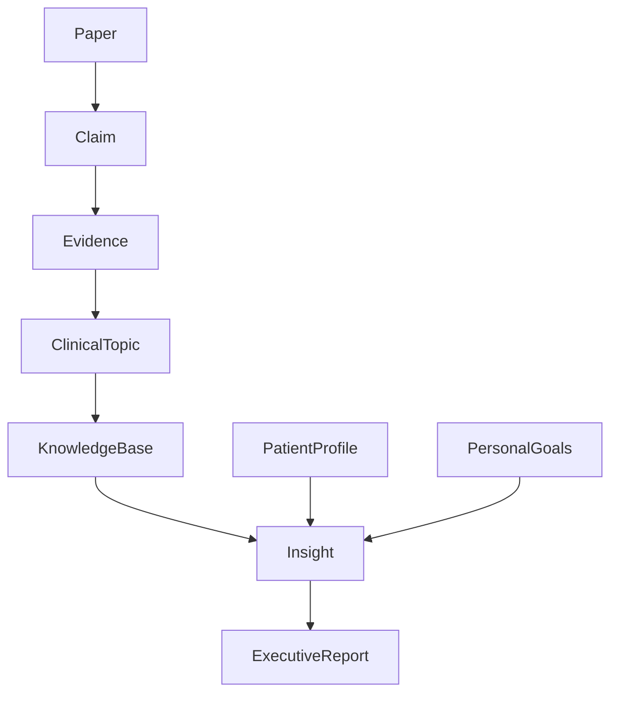

# Domain Model

**Version:** 1.0.0  
**Status:** Draft  
**Last Updated:** 2026-07-10

---

# Purpose

This document defines the conceptual model of the Knee Research Agent (KRA).

It describes the core entities, their relationships and the lifecycle of knowledge inside the system.

The domain model is independent of any implementation technology.

---

# Knowledge Flow

Scientific knowledge flows through the system following a continuous lifecycle.

```text
Scientific Literature
        │
        ▼
      Paper
        │
        ▼
      Claim
        │
        ▼
     Evidence
        │
        ▼
 Living Clinical Topic
        │
        ▼
 Consolidated Knowledge
        │
        ▼
 Personal Insight
        │
        ▼
 Executive Report
```

Each stage increases the level of abstraction while preserving traceability to the original evidence.

---

# Core Entities

## Paper

A scientific publication.

Examples:

- Randomized Controlled Trial
- Systematic Review
- Meta-analysis
- Clinical Guideline

A Paper is immutable.

It never changes after publication.

---

## Claim

A factual statement extracted from a Paper.

Examples:

- PRP reduced WOMAC score.
- No significant improvement was observed.
- Adverse events were minimal.

Claims are atomic.

Each Claim must reference exactly one Paper.

---

## Evidence

Evidence is produced by evaluating one or more Claims.

Evidence includes:

- confidence
- quality
- consistency
- contradictions
- strength

Evidence evolves over time.

---

## Living Clinical Topic

The central entity of the system.

Examples:

- PRP
- Knee Osteoarthritis
- Meniscus Scaffold
- Stem Cells
- Cartilage Regeneration

A Living Clinical Topic is continuously updated as new Evidence becomes available.

Topics are never considered finished.

---

## Knowledge Base

The complete collection of Living Clinical Topics.

The Knowledge Base represents the current state of medical understanding maintained by the system.

---

## Patient Profile

Represents objective characteristics of an individual.

Examples:

- age
- sex
- diagnoses
- surgeries
- activity level
- imaging findings

Scientific evidence never depends on the Patient Profile.

---

## Personal Goals

Represents what the individual wants to achieve.

Examples:

- Delay knee replacement
- Continue playing padel
- Reduce pain
- Improve mobility
- Preserve cartilage

Goals influence prioritisation but never scientific evidence.

---

## Insight

A personalised interpretation produced by combining:

- Knowledge
- Patient Profile
- Personal Goals

Insights are recommendations for discussion.

They are never medical advice.

---

## Executive Report

A periodic summary of:

- new evidence
- updated topics
- important changes
- personalised insights
- open research questions

Executive Reports are immutable historical snapshots.

---

# Entity Relationships



---

# Knowledge Lifecycle

Knowledge evolves continuously.

```
Acquire

↓

Extract

↓

Evaluate

↓

Consolidate

↓

Personalise

↓

Publish

↓

Monitor

↓

Update
```

No entity representing medical knowledge is ever considered final.

---

# Design Rules

## Rule 1

Scientific evidence is objective.

Personalisation happens afterwards.

---

## Rule 2

Topics evolve.

Reports do not.

---

## Rule 3

Every conclusion must be traceable to supporting evidence.

---

## Rule 4

Knowledge is preferred over documents.

Documents are representations.

Knowledge is the asset.

---

## Rule 5

Uncertainty must always be preserved.

Confidence is never hidden.

---

# Relationship to Other Documents

The project goals are described in `SPECIFICATION.md`.

The problem space is described in `PROBLEM_STATEMENT.md`.

Terminology is defined in `GLOSSARY.md`.

Architectural decisions are recorded as ADRs.